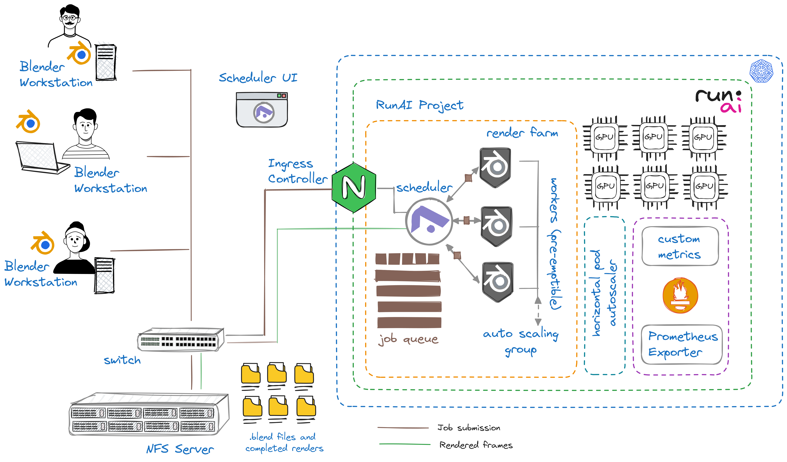

# Autoscaling render farm for Blender

  
  

## Overview

Welcome to the Run AI Blender Rendering Farm project! This project is designed to streamline and scale 3D rendering tasks using a Kubernetes-based architecture integrated with Run:AI. By leveraging GPU acceleration, our rendering farm efficiently processes Blender jobs, providing both scalability and performance.

The project automates the setup of a rendering farm, capable of handling large-scale Blender rendering workloads. Users can submit rendering jobs, monitor GPU usage, and optimize resource allocation to maximize performance.

Key features include:

- **Model on workstation, render remote** allows multiple users and negates the need to use a clunky VPC for model development.
- **GPU acceleration** for faster renders.
- **Dynamic scaling** smart autoscaling based on custom GPU metrics.
- **Distributed rendering** for batch processing of Blender scenes.

## Pre-requisites

Before setting up the Blender Rendering Farm, ensure you have the following dependencies in place:

- **Kubernetes Cluster**: A functional Run AI cluster (version 2.18+ recommended).
- **Helm**: Version 3 or higher to deploy the farm via Helm charts.
- **Blender**: Blender 2.8+ for creating and submitting your rendering jobs (runs on your workstation).
- **Persistent Storage**: An NFS server for storing rendered outputs. This must be accessible both by the cluster and the user workstation.
- **Host Based Routing**: The Flamenco scheduler will not run if you are using the default path based routing. See [here](https://docs.run.ai/latest/admin/config/allow-external-access-to-containers/?h=routing#workspaces-configuration) to enable.

## Architecture

  

## Scope

The helm chart is designed to service multiple users in the same environment. It allows model creators to use a "fire and forget" rendering approach that does not tie up their workstation with intensive rendering tasks for days or weeks.

The worker group in the rendering farm is an autoscaling group that uses the full project quota before seeking unused quota in other projects and departments that have over-quota enabled. The workers are pre-emptible but the Flamenco scheduler tracks each batch of work to ensure that if a worker is pre-empted, that batch is placed back in the queue.

## Configuration

The chart may be configured prior to install by editing the relevant fields in values.yaml file. Although most of the default parameters may remain as is, it's important to ensure that the fields relating to NFS storage are correctly updated for your use case.

> [!NOTE]
It is a hard requirement that the same NFS share is mounted on the users workstation. The > default drive (Windows) is 'Z:\'. Defaults for Windows and other OS may be set in values.yaml

## Usage

- Create a project in Run AI with a GPU quota and enable over-quota.
- Clone this repo to you blender machine
- Change into the "render-farm" directory
- edit "values.yaml". Ensure the project name is correct and update the paramaters for your NFS Share
- Install the helm chart using `helm install blender . -f values.yaml`